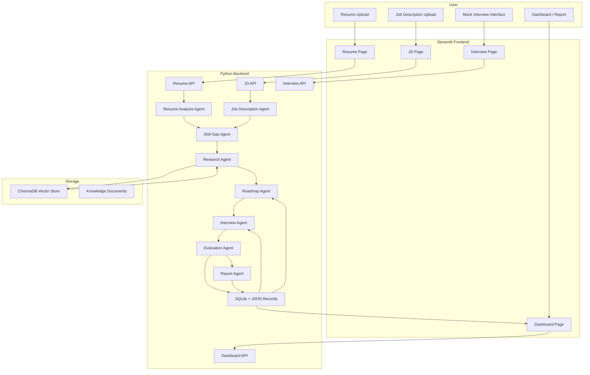

# AI Agent for Students

## Phase 1: Architecture Design

### 1. System Architecture Overview

The Multi-Agent RAG Interview Coach is an orchestrated, modular AI agent system built with LangGraph, LangChain, and production-grade Python infrastructure. It is a non-chatbot, adaptive agent ecosystem that integrates resume and job description analysis, skill gap detection, learnable RAG retrieval, mock interview orchestration, evaluation, and personalized reporting.

Key architecture dimensions:
- Multi-agent architecture with dedicated responsibilities
- LangGraph workflow orchestration for agent coordination
- RAG with ChromaDB and Gemini embeddings
- Persistent memory using SQLite
- Streamlit frontend with professional multipage navigation
- Clean, testable backend modules


### 2. Agent Interaction Diagram

Agents communicate through a central LangGraph orchestrator and share structured outputs through typed interfaces. Each agent specializes in a portion of the interview coaching pipeline.

Agents:
- Resume Analysis Agent
- Job Description Agent
- Skill Gap Agent
- Research Agent (RAG Agent)
- Roadmap Agent
- Interview Agent
- Evaluation Agent
- Report Agent

Interaction flow:
1. User uploads resume and job description
2. Resume Analysis Agent extracts structured candidate data
3. Job Description Agent extracts structured hiring requirements
4. Skill Gap Agent calculates gaps and readiness
5. Research Agent fetches curated learning and interview context
6. Roadmap Agent builds adaptive preparation plan
7. Interview Agent executes the mock interview loop
8. Evaluation Agent scores responses and identifies weaknesses
9. Report Agent synthesizes the final readiness report
10. Memory module stores progress history and adapts future sessions


### 3. LangGraph Workflow Diagram

The LangGraph workflow orchestrates sequential and adaptive agent execution with conditional branching for adaptive interviewing.

Workflow steps:
- `resume_ingest` -> Resume Analysis Agent
- `jd_ingest` -> Job Description Agent
- `skill_gap_analysis` -> Skill Gap Agent
- `rag_retrieve` -> Research Agent
- `roadmap_generation` -> Roadmap Agent
- `mock_interview_loop` -> Interview Agent
- `answer_evaluation` -> Evaluation Agent
- `final_report` -> Report Agent
- `memory_update` -> Memory Store

Adaptive branching inside the workflow:
- If `Skill Gap Agent` identifies weak topics, route interview questions to those topics.
- If `Evaluation Agent` finds low confidence, route Roadmap Agent to update recommendations.
- If `Interview Agent` detects repeated weaknesses, add extra follow-up questions and knowledge retrieval.


### 4. Mermaid Architecture Diagram




### 5. Database Design

The persistent data model is SQLite for structured session history, user progress, and memory. ChromaDB is used separately for vector store retrieval.

SQLite tables:
- `users`
  - `id`
  - `name`
  - `email`
  - `created_at`

- `sessions`
  - `id`
  - `user_id`
  - `resume_id`
  - `job_description_id`
  - `skill_gap_report`
  - `roadmap`
  - `final_report`
  - `created_at`
  - `updated_at`

- `resume_profiles`
  - `id`
  - `session_id`
  - `parsed_skills`
  - `projects`
  - `experience_summary`
  - `certifications`
  - `technologies`
  - `raw_text`

- `job_descriptions`
  - `id`
  - `session_id`
  - `required_skills`
  - `technologies`
  - `responsibilities`
  - `seniority_level`
  - `keywords`
  - `raw_text`

- `interview_history`
  - `id`
  - `session_id`
  - `question`
  - `topic`
  - `answer`
  - `evaluation`
  - `feedback`
  - `created_at`

- `performance_trends`
  - `id`
  - `session_id`
  - `technical_score`
  - `communication_score`
  - `problem_solving_score`
  - `confidence_score`
  - `readiness_score`
  - `weak_topics`
  - `strong_topics`
  - `created_at`

ChromaDB store schema:
- Embedded documents with metadata:
  - `title`
  - `topic`
  - `source`
  - `content`
  - `tags`
  - `difficulty`
  - `created_at`


### 6. RAG Design

The RAG subsystem supports adaptive retrieval for interview questions, learning content, and feedback generation.

Components:
- Document ingestion pipeline with chunking
- Gemini embeddings for semantic vectorization
- ChromaDB for persistent vector retrieval
- Context injection into agent prompts
- Fallback to sentence-transformers when Gemini is unavailable

Document ingestion:
- Source content includes ML, DL, LLM Engineering, RAG, Prompt Engineering, Python, DS, System Design, MLOps
- Documents are chunked by semantic boundaries and metadata tagging
- Each chunk is embedded and stored in ChromaDB

Retrieval workflow:
1. Build query from skill gap and interview context
2. Retrieve top-N relevant chunks
3. Filter by topic and difficulty
4. Inject retrieved context into Research Agent and Interview Agent prompts
5. Use source citations in generated recommendations


### 7. Folder Structure

Proposed project structure for clean architecture and production readiness:

```
ai 5 day agent work/
├── ARCHITECTURE.md
├── src/
│   ├── backend/
│   │   ├── __init__.py
│   │   ├── config.py
│   │   ├── logging.py
│   │   ├── database.py
│   │   ├── models/
│   │   │   ├── __init__.py
│   │   │   ├── schema.py
│   │   │   ├── agents.py

│   │   ├── services/
│   │   │   ├── __init__.py
│   │   │   ├── resume_service.py
│   │   │   ├── jd_service.py
│   │   │   ├── gap_service.py
│   │   │   ├── rag_service.py
│   │   │   ├── roadmap_service.py
│   │   │   ├── interview_service.py
│   │   │   ├── evaluation_service.py
│   │   │   ├── report_service.py
│   │   │   ├── memory_service.py
│   │   │   └── ingestion_service.py
│   │   
│   │   ├── agents/
│   │   │   ├── __init__.py
│   │   │   ├── resume_agent.py
│   │   │   ├── jd_agent.py
│   │   │   ├── gap_agent.py
│   │   │   ├── research_agent.py
│   │   │   ├── roadmap_agent.py
│   │   │   ├── interview_agent.py
│   │   │   ├── evaluation_agent.py
│   │   │   ├── report_agent.py
│   │   │   └── langgraph_workflow.py
│   │   
│   │   ├── storage/
│   │   │   ├── __init__.py
│   │   │   ├── chroma_client.py
│   │   │   ├── sqlite_client.py
│   │   │   └── memory_store.py
│   │   
│   │   ├── utils/
│   │   │   ├── __init__.py
│   │   │   ├── pdf_parser.py
│   │   │   ├── text_processing.py
│   │   │   ├── evaluation_metrics.py
│   │   │   ├── persistence.py
│   │   │   └── langchain_utils.py
│   │   
│   │   └── api/
│   │       ├── __init__.py
│   │       ├── app.py
│   │       ├── routes.py
│   │       └── schemas.py
│   
│   ├── frontend/
│   │   ├── __init__.py
│   │   ├── app.py
│   │   ├── pages/
│   │   │   ├── home.py
│   │   │   ├── upload_resume.py
│   │   │   ├── upload_job_description.py
│   │   │   ├── skill_gap_analysis.py
│   │   │   ├── learning_roadmap.py
│   │   │   ├── mock_interview.py
│   │   │   ├── evaluation_dashboard.py
│   │   │   ├── interview_history.py
│   │   │   └── final_report.py
│   │   └── assets/
│   │       ├── styles.css
│   │       └── images/
│   
│   ├── tests/
│   │   ├── __init__.py
│   │   ├── unit/
│   │   ├── integration/
│   │   ├── agents/
│   │   └── rag/
│   
│   └── data/
│       ├── knowledge_sources/
│       ├── embeddings/
│       └── raw_documents/
│   
├── docs/
│   ├── architecture.md
│   ├── deployment.md
│   └── test_plan.md
```


### 8. Architectural Decisions

- **Modular agent separation** ensures each agent is testable and replaceable.
- **LangGraph orchestration** provides structured workflows and adaptive branching for interview logic.
- **SQLite + ChromaDB** separates user/session memory from vector retrieval storage.
- **Pydantic schemas** enforce structured JSON contract between agents and storage.
- **Streamlit frontend** supports a polished multipage experience while keeping the backend logic isolated.
- **RAG-first retrieval** provides evidence-backed coaching and domain-specific explanations.
- **Adaptive interview loop** means evaluation drives follow-up questioning and roadmap updates.


### 9. Next Step

The next phase will generate the project setup files: `requirements.txt`, `.env.example`, configuration modules, and initial project scaffolding.
