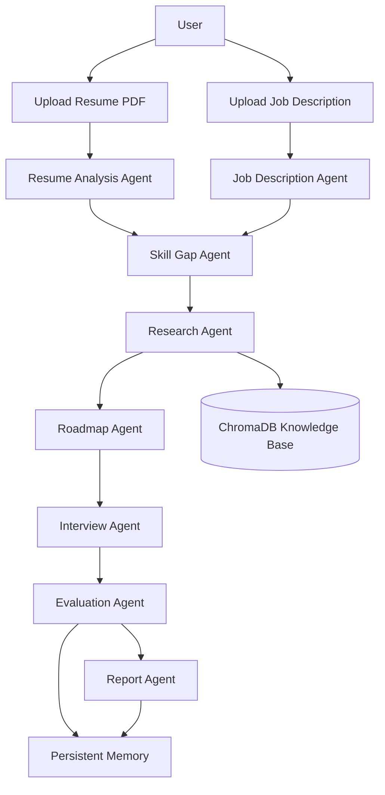

# AI Agent for Students

Capstone-grade multi-agent interview preparation system built with LangGraph, LangChain, Google Gemini embeddings, ChromaDB, Streamlit, SQLite, and Pydantic.

This project is not a chatbot. It is an adaptive agentic workflow that analyzes a resume and job description, detects skill gaps, retrieves learning material with RAG, runs a mock interview loop, evaluates answers, updates the roadmap, and generates a final readiness report.

## Project Overview

The system helps technical candidates prepare for interviews with the following workflow:

1. Upload resume PDF
2. Upload job description text
3. Extract structured candidate and role data
4. Compare resume against the role
5. Detect strengths, weak skills, and missing skills
6. Retrieve learning material from the knowledge base
7. Generate an adaptive learning roadmap
8. Run an interview simulation with follow-up questions
9. Evaluate responses and track scores over time
10. Persist memory of interview history and progress
11. Generate a final readiness report

## Why This Project Stands Out

- Multi-agent architecture with specialized responsibilities
- LangGraph workflow orchestration for adaptive routing
- RAG retrieval backed by ChromaDB and Gemini embeddings
- Persistent memory using SQLite and JSON session records
- Production-oriented FastAPI backend and Streamlit frontend
- Structured Pydantic models and typed service boundaries
- Test coverage for services, RAG, API, and frontend imports

## Architecture

### Backend

- `src/backend/agents`: LangGraph-oriented agent wrappers and orchestration
- `src/backend/services`: Core business logic for parsing, scoring, RAG, interviews, evaluation, roadmap generation, and reporting
- `src/backend/storage`: SQLite, memory, and ChromaDB persistence helpers
- `src/backend/utils`: PDF parsing and text extraction utilities
- `src/backend/api`: FastAPI app, routes, and request schemas

### Frontend

- `src/frontend/app.py`: Streamlit multipage application shell
- `src/frontend/pages`: User-facing workflow pages
- `src/frontend/services/api_client.py`: Shared HTTP and local JSON helpers

### Data

- `src/data/raw_documents`: Source knowledge-base content for ingestion
- `src/data/embeddings`: Persistent ChromaDB vector store
- `src/data/memory`: Persistent interview memory records
- `src/data/*.json`: Saved frontend artifacts such as profiles, roadmap, evaluation, and final report

### Core Agents

- Resume Analysis Agent
- Job Description Agent
- Skill Gap Agent
- Research Agent
- Roadmap Agent
- Interview Agent
- Evaluation Agent
- Report Agent

## Mermaid Architecture



## Folder Structure

```text
ai 5 day agent work/
├── ARCHITECTURE.md
├── README.md
├── requirements.txt
├── pyproject.toml
├── .env.example
├── Dockerfile
├── docker-compose.yml
├── docs/
│   ├── deployment.md
│   └── test_plan.md
├── src/
│   ├── backend/
│   ├── frontend/
│   └── data/
└── tests/
```

## Installation

1. Create and activate a virtual environment:

```powershell
cd "c:\Users\rohan\OneDrive\Desktop\ai 5 day agent work"
python -m venv .venv
.
.venv\Scripts\Activate.ps1
```

2. Install dependencies:

```powershell
pip install -r requirements.txt
```

3. Copy the environment template and configure your keys:

```powershell
copy .env.example .env
```

Required environment variables:
- `GOOGLE_API_KEY`
- `GOOGLE_PROJECT_ID`

Optional overrides:
- `DATABASE_URL`
- `CHROMA_DB_DIR`
- `DOCS_PATH`
- `LOG_LEVEL`
- `STREAMLIT_SERVER_PORT`

## Usage

### Start the backend

```powershell
python src/backend/run.py
```

### Start the frontend

```powershell
python src/frontend/run.py
```

### Open the app

- Streamlit frontend: `http://localhost:8501`
- Backend API: `http://localhost:8000`
- Backend health check: `http://localhost:8000/health`

## Recommended Workflow

1. Upload the resume PDF.
2. Enter or paste the job description.
3. Run skill gap analysis.
4. Generate the learning roadmap.
5. Ingest the knowledge base documents.
6. Generate mock interview questions.
7. Answer the questions and submit the evaluation.
8. Review the dashboard and memory summary.
9. Generate and download the final report.

## Screenshots

Add screenshots here when preparing a presentation or submission package.

- Home page placeholder
- Upload resume page placeholder
- Upload job description page placeholder
- Skill gap analysis page placeholder
- Learning roadmap page placeholder
- Mock interview page placeholder
- Evaluation dashboard placeholder
- Interview history page placeholder
- Final report page placeholder

## Testing

Run the complete test suite:

```powershell
pytest tests -q
```

Current test coverage includes:
- Backend compile checks
- Frontend compile checks
- API health and route tests
- Service behavior tests
- RAG and API integration tests

## Deployment

Detailed deployment instructions are in [docs/deployment.md](docs/deployment.md).

Supported deployment paths:
- Local development
- Docker Compose
- Streamlit Cloud

## Data and Persistence

- SQLite stores structured session and trend data.
- JSON files under `src/data` store saved frontend artifacts.
- ChromaDB persists vector embeddings in `src/data/embeddings`.
- Session memory is persisted in `src/data/memory`.

## Future Improvements

- Replace the Gemini embedding fallback path with the newer Google GenAI SDK
- Add authentication and user accounts
- Move structured persistence from SQLite to PostgreSQL for production use
- Add CI/CD workflows and automated deployment checks
- Expand the knowledge base with more curated interview documents
- Add richer charts and trend visualizations in the frontend
- Persist multi-session evaluation history in a queryable analytics store

## Project Files of Interest

- [src/backend/api/app.py](src/backend/api/app.py)
- [src/backend/api/routes.py](src/backend/api/routes.py)
- [src/backend/agents/langgraph_workflow.py](src/backend/agents/langgraph_workflow.py)
- [src/backend/services/rag_service.py](src/backend/services/rag_service.py)
- [src/backend/services/interview_service.py](src/backend/services/interview_service.py)
- [src/frontend/app.py](src/frontend/app.py)
- [docs/deployment.md](docs/deployment.md)

## Summary

This project demonstrates:

- Multi-agent orchestration
- Adaptive interview logic
- Retrieval-augmented generation
- Persistent memory and trend tracking
- Production-oriented Python engineering
- End-to-end workflow from ingestion to final report
